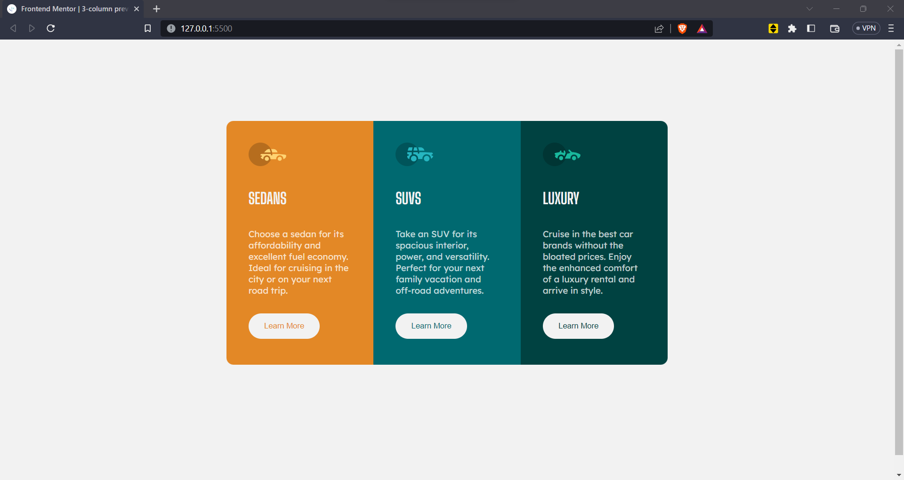
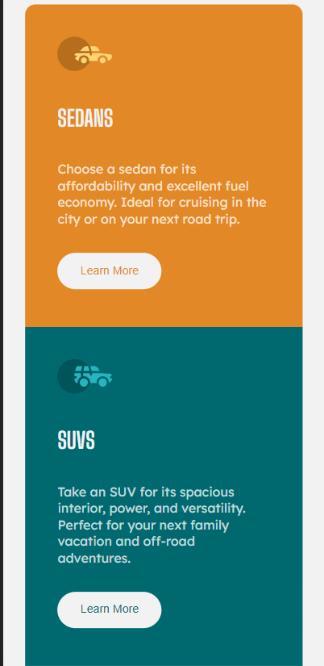

# Frontend Mentor - 3-column preview card component solution

This is a solution to the [3-column preview card component challenge on Frontend Mentor](https://www.frontendmentor.io/challenges/3column-preview-card-component-pH92eAR2-). Frontend Mentor challenges help you improve your coding skills by building realistic projects. 

## Table of contents

- [Overview](#overview)
  - [The challenge](#the-challenge)
  - [Screenshot](#screenshot)
  - [Links](#links)
- [My process](#my-process)
  - [Built with](#built-with)
  - [What I learned](#what-i-learned)
  - [Continued development](#continued-development)
 
- [Author](#author)

**Note: Delete this note and update the table of contents based on what sections you keep.**

## Overview

### The challenge

Users should be able to:

- View the optimal layout depending on their device's screen size
- See hover states for interactive elements

### Screenshot

**Note: Delete this note and the paragraphs above when you add your screenshot. If you prefer not to add a screenshot, feel free to remove this entire section.**

### Links

- Solution URL: [Add solution URL here](https://your-solution-url.com)
- Live Site URL: [Add live site URL here](https://your-live-site-url.com)

## My process

### Built with

- Semantic HTML5 markup
- CSS custom properties
- 
- CSS Grid
- Mobile-first workflow
- For styles

**Note: These are just examples. Delete this note and replace the list above with your own choices**

### What I learned

Made use of a the mobile first approach which helped me improve at media queries

Used CSS Gird to create the columns

Understood why i should use outline instead of border for hover states

Got more practice with SCSS and BEM

**Note: Delete this note and the content within this section and replace with your own learnings.**

### Continued development
I would like to focus more on mobile first and learn more responsive techniques,as well as learn more asthetics designs

## Author

- Frontend Mentor - [@MackenanDsouza](https://www.frontendmentor.io/profile/MackenanDsouza)
- Instagram - [@mackenandsouza](https://instagram.com/mackenan.dsouza?igshid=ZDdkNTZiNTM=)

